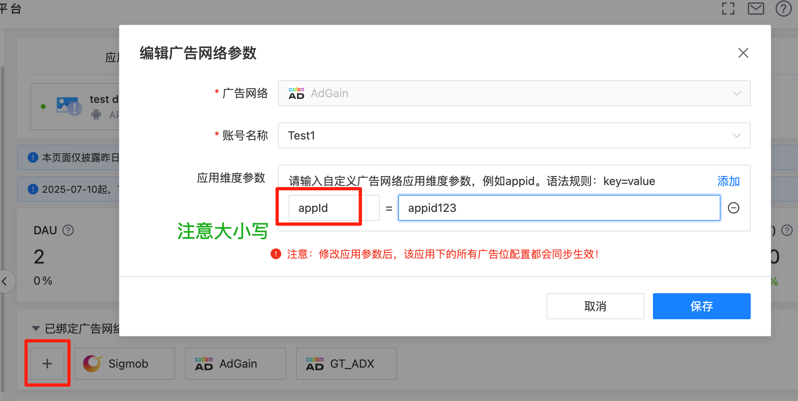
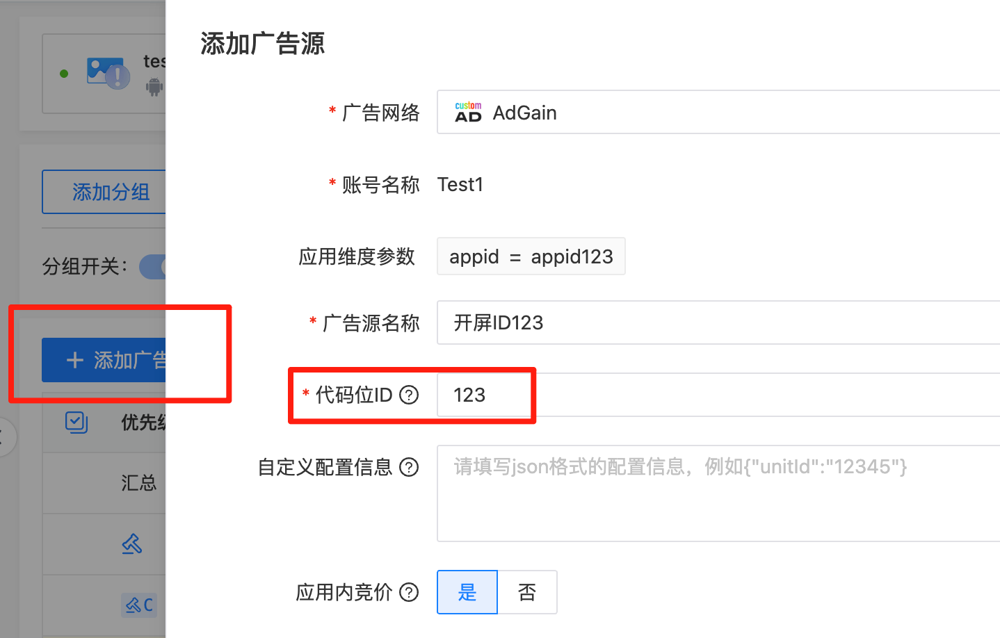
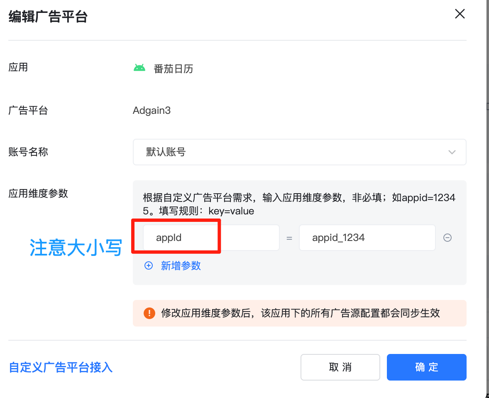
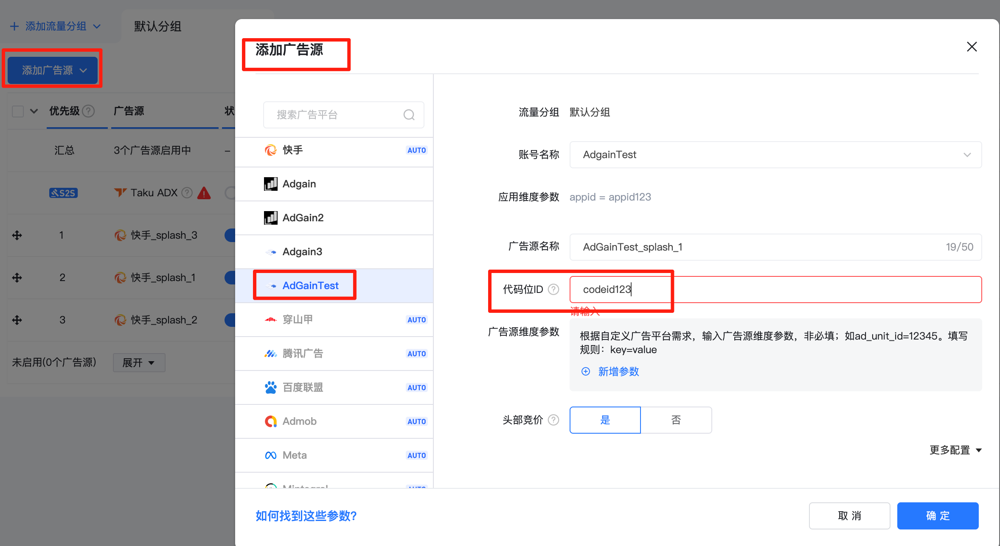
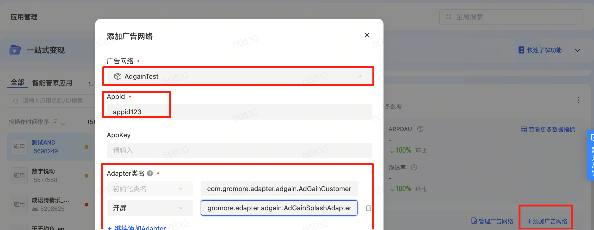
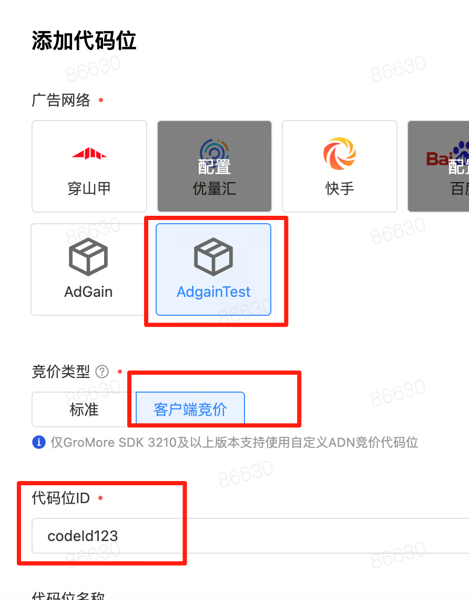

# AdGain SDK-Android接入文档

**注意：**

- 本 SDK 最低兼容 `Android API 21（Android 5.0）`

- 竞胜竞败回传：AdGain平台根据媒体传回来的竞胜竞败价格，通过相应算法自动提高出价来获得广告曝光，媒体RTB时一定要调用，否则会导致价格出不上去。

- 媒体接入信通院 `oaid-sdk`，在初始化的时候可以通过CustomController里面的getOaid()传入获取到的oaid

- <strong color='blue'>官网后台：</strong>https://gdsmilemg.datads.cn/

  

## 一、导入SDK依赖

**1.1、压缩包目录结构**

| 文件目录            | 目录说明                                               |
| ------------------- | ------------------------------------------------------ |
| AdGain/libs/***.aar | 项目中依赖的AdGain SDK文件,三大聚合平台Adapter AAR文件 |
| adgaindemo          | 示例工程, 用来方便媒体参考接入.                        |
| demo-release.apk    | 示例APP, 用来演示广告提供的多种广告展现形式.           |
| README.md           | Adgain SDK-Android接入文档.                            |

**1.2、导入SDK文件**

1.2.1、在 app 目录下新建 libs 文件夹.

1.2.2、将AdGain/libs目录下的文件拷贝到libs文件夹下.

1.2.3、在 app/build.gradle 添加如下代码：

```groovy
repositories {
  flatDir {
      dirs 'libs'
  }
}
dependencies {
	// 集成AdGain SDK需导入的aar
	implementation(name: 'adgain-sdk-4.2.1', ext: 'aar')
}
```

**1.3、AndroidManifest配置**

添加访问权限:在AndroidManifest.xml文件中添加，建议在您的隐私协议中向开发者声明Octopus SDK会获取下述权限并应用于广告投放

```xml
<!--必要权限-->
<uses-permission android:name="android.permission.INTERNET" />
<!--可选权限-->
<uses-permission android:name="android.permission.ACCESS_NETWORK_STATE" />
<!--仅用于获取IMEI或者运营商信息-->
<uses-permission android:name="android.permission.READ_PHONE_STATE" />
<!--  下载类安装权限，下载完需要申请，否则无法进行安装影响拉新类预算-->
<uses-permission android:name="android.permission.REQUEST_INSTALL_PACKAGES" />
```

注意：AdGain SDK不强制获取可选权限，即使没有获取可选权限SDK也能正常运行

**1.4、混淆配置**

```java
# Adgain混淆
-dontwarn com.adgain.sdk.*
-keep class com.adgain.sdk.* {*;}
```


---


## 二、SDK初始化

**2.1、代码实现**

~~~java

        // 个性化广告开关设置
        AdGainSdk.getInstance().setPersonalizedAdvertisingOn(true);
        
        Map<String, Object> customData = new HashMap<>();
        customData.put("custom_key", "custom_value");

        AdGainSdk.getInstance().init(this, new AdGainSdkConfig.Builder()
                .appId("")       //必填，向广推商务获取
                .userId("")      // 用户ID，有就填
                .showLog(false)   // 是否展示adsdk内部日志，正式环境务必为false
                .addCustomData(customData)  //自定义数据
                .customController(new CustomController() {
                    // 是否允许SDK获取位置信息
                    @Override
                    public boolean canReadLocation() {
                        return true;
                    }

                    // 是否允许SDK获取手机信息
                    @Override
                    public boolean canUsePhoneState() {
                        return true;
                    }
                    
                    // 是否允许SDK使用AndoridId
                    @Override
                    public boolean canUseAndroidId() {
                        return true;
                    }
                    // 是否允许SDK获取Wifi状态
                    @Override
                    public boolean canUseWifiState() {
                        return true;
                    }
                    // 为SDK提供oaid
                    @Override
                    public String getOaid() {
                        return "";
                    }
                })
                .setInitCallback(new InitCallback() {
                    // 初始化成功回调，初始化成功后才可以加载广告
                    @Override
                    public void onSuccess() {
                        Log.d(Constants.LOG_TAG, "init--------------onSuccess-----------");
                    }

                    // 初始化失败回调
                    @Override
                    public void onFail(int code, String msg) {
                        Log.d(Constants.LOG_TAG, "init--------------onFail-----------" + code + ":" + msg);
                    }
                }).build());
        
~~~

**2.1、 初始化相关类说明**

***2.1.1 AdGainSdkConfig***

> com.adgain.sdk.api.AdGainSdkConfig.Builder

| 方法名                                        | 方法介绍                                                 |
| --------------------------------------------- | -------------------------------------------------------- |
| appId(String appId)                           | 必须，每个应用单独一个appid                              |
| showLog(boolean isLog)                        | sdk是否开启debug日志打印信息，默认开启。                 |
| userId(String userId)                         | 用户Id(非必填)                                           |
| addCustomData(Map<String, String> customData) | 初始化传入的自定义数据。                                 |
| customController(CustomController custom)     | 设置自定义设备信息，具体可参考下方CustomController实体类 |
| setInitCallback(InitCallback callBack)        | 初始化回调通知，具体可参考InitCallback实体类             |

***2.1.2 CustomController***

> com.adgain.sdk.api.CustomController

| 方法名             | 方法介绍                                                     |
| ------------------ | ------------------------------------------------------------ |
| canReadLocation()  | 是否可以读取设备位置信息                                     |
| getLocation()      | 如果不能获取地理位置，APP内部有获取位置信息，可在该方法回传  |
| canUsePhoneState() | 是否可以获取设备IMEI等信息。                                 |
| canUseAndroidId()  | 是否可以获取设备AndroidID                                    |
| getImei()          | 如果 canUsePhoneState为false,在Android低版本系统中获取到的Imei进行回传 |
| getMacAddress()    | 回传MacAddrerss信息                                          |
| canUseWifiState()  | 是否可以获取设备WIFI状态等信息。                             |
| String getOaid()   | 传入通过信通院的OAID库获取到的oaid值                         |

***2.1.3 InitCallback***

> com.adgain.sdk.api.InitCallback

| 方法名                            | 方法介绍          |
| --------------------------------- | ----------------- |
| void onSuccess()                  | sdk初始化成功回调 |
| void onFail(int code, String msg) | sdk初始化失败回调 |

**2.2、 个性化广告设置（可选）**

```java
AdGainSdk.getInstance().setPersonalizedAdvertisingOn(boolean personal);    
```


## 三、开屏广告

**3.1 开屏广告加载**

```java
// 创建ad请求
AdRequest adRequest = new AdRequest.Builder()
        .setCodeId(Constants.SPLASH_ADCOID) // 广告位ID
        .setWidth(UIUtil.getScreenWidthInPx(this)) // 设置需要的广告视图宽度
        .setHeight(getSplashHeight()) // 设置需要的广告视图高度
        .setExtOption(new HashMap()) // 设置透传的自定义数据
        .build();
// 创建开屏AD API对象，监听回调在这里设置,5 * 1000为请求广告超时时间
splashAd = new SplashAd(adRequest, mSplashAdListener, 5 * 1000);
// 加载广告
splashAd.loadAd();
```

**3.2 开屏广告展示**

```java
// 展示前先判断广告是否ready
if (splashAd != null && splashAd.isReady()) {
    splashAd.showAd(splashLY);
} 
```

**3.3 SplashAdListener回调**

```java
 private final SplashAdListener mSplashAdListener = new SplashAdListener() {

        @Override
        public void onAdLoadSuccess() {
            Log.d(Constants.LOG_TAG, "--LoadSuc:" + splashAd.isReady() + " " + splashAd.getBidPrice());
        }

        @Override
        public void onAdCacheSuccess() {
            Log.d(Constants.LOG_TAG, "----------onAdCacheSuccess-----" + splashAd.isReady());
            
        }

        // 广告加载失败
        @Override
        public void onSplashAdLoadFail(AdError error) {
            Log.d(Constants.LOG_TAG, "----------onSplashAdLoadFail----------" + error.toString());
            gotoMainActivity();
        }

        @Override
        public void onSplashAdShow() {
            Log.d(Constants.LOG_TAG, "----------onSplashAdShow----------");

        }

        // 广告展示错误
        @Override
        public void onSplashAdShowError(AdError error) {
            Log.d(Constants.LOG_TAG, "-----onSplashAdShowError----------" + error.toString());
            gotoMainActivity();
        }

        // 广告被用户点击
        @Override
        public void onSplashAdClick() {
            Log.d(Constants.LOG_TAG, "----onSplashAdClick----------");
        }

        // 广告关闭
        @Override
        public void onSplashAdClose(boolean isSkip) {
            Log.d(Constants.LOG_TAG, "----------onSplashAdClose---------" + isSkip);
            if (isForeground) {
                gotoMainActivity();
            } else {
                // 不在前台，说明打开了广告中的链接，等回到 onResume 时再跳转
                getLifecycle().addObserver(new LifecycleEventObserver() {
                    @Override
                    public void onStateChanged(LifecycleOwner source,Lifecycle.Event event) {
                        if (Lifecycle.Event.ON_RESUME == event) {
                            getLifecycle().removeObserver(this);
                            gotoMainActivity();
                        }
                    }
                });
            }
        }
    };
```

**3.4. 开屏API介绍**

***3.4.1 SplashAd***

> com.adgain.sdk.api.SplashAd

| 方法名                                                       | 方法介绍                                                     |
| ------------------------------------------------------------ | ------------------------------------------------------------ |
| SplashAd(AdRequest adRequest, SplashAdListener adListener)   | 构造方法，广告相关状态会通过 adListener 通知开发者。参数说明：adRequest（广告请求对象）、adListener（广告状态监听器）。 |
| SplashAd(AdRequest adRequest, SplashAdListener adListener, long timeout) | adRequest 设置codeId, adListener 加载及交互监听，timeout 加载超时时间 |
| void loadAd()                                                | 请求广告。                                                   |
| boolean isReady()                                            | 广告是否准备好，未准备好广告将无法展示                       |
| void showAd(ViewGroup adContainer)                           | 展示广告。参数说明：adContainer（展示广告的容器不可为null）  |
| void destroyAd()                                             | 当广告关闭不再使用时，必须调用此方法释放资源                 |

***3.4.2 AdRequest***

> com.adgain.sdk.api.AdRequest.Builder

| 方法名                                  | 方法介绍                                              |
| --------------------------------------- | ----------------------------------------------------- |
| setCodeId(String codeid)                | 设置广告位ID                                          |
| setBidFloor(int bidFloor)               | 设置广告请求的底价，单位分                            |
| setExtOption(Map<String,Object> option) | 设置扩展参数。参数说明：options（扩展参数，可传任意） |

***3.4.3 SplashAdListener***

> com.adgain.sdk.api.SplashAdListener

| 方法名                                  | 方法介绍                                            |
| --------------------------------------- | --------------------------------------------------- |
| void onSplashAdLoadSuccess()            | 数据广告成功加载                                    |
| void onAdCacheSuccess()                 | 广告物料下载缓存成功                                |
| void onSplashAdLoadFail(AdError error)  | 广告加载失败                                        |
| void onSplashAdShow()                   | 曝光回调                                            |
| void onSplashAdClick()                  | 点击回调                                            |
| void onSplashAdShowError(AdError error) | 广告展示失败                                        |
| void onSplashAdClose(boolean isSkip)    | 广告关闭，isSkip标记点击跳过还是倒计时走完触发Close |

**3.5 开屏广告销毁**

```java
// 界面销毁时，执行销毁Ad接口
if (splashAd != null) {
    splashAd.destroyAd();
    splashAd = null;
}
```


## 四、插屏广告

**4.1 插屏广告加载**

```java
AdRequest adRequest = new AdRequest.Builder()
                .setCodeId(codeId)
                .setExtOption(options)
                .build();
mInterstitialAd = new InterstitialAd(adRequest, listener);
mInterstitialAd.loadAd();
```

**4.2 插屏广告展示**

```java
if (interstitialAd != null && interstitialAd.isReady()) {
    interstitialAd.showAd( activity );
}
```

**4.3 InterstitialAdListener回调**

           InterstitialAdListener listener = new InterstitialAdListener() {
                @Override
                public void onInterstitialAdLoadError(AdError error) { }
    
            @Override
            public void onInterstitialAdLoadSuccess() {
    
            }
    
            @Override
            public void onInterstitialAdLoadCached() {
    
            }
    
            @Override
            public void onInterstitialAdShow() {
    
            }
    
            @Override
            public void onInterstitialAdPlayEnd() {
    
            }
    
            @Override
            public void onInterstitialAdClick() {
    
            }
    
            @Override
            public void onInterstitialAdClosed() {
    
            }
    
            @Override
            public void onInterstitialAdShowError(AdError error) {
    
            }
        };

**4.4 插屏广告销毁**

```java
if (interstitialAd != null) {
    interstitialAd.destroyAd();
    interstitialAd = null;
}
```

**4.5 插屏API介绍**

***4.5.1 InterstitialAd***

> com.adgain.sdk.api.InterstitialAd

| 方法名                                                       | 方法介绍                                                     |
| ------------------------------------------------------------ | ------------------------------------------------------------ |
| InterstitialAd(AdRequest adRequest, InterstitialAdListener adListener) | 构造方法。参数说明：request（广告请求对象）、adListener（广告状态回调监听） |
| loadAd()                                                     | 拉取广告                                                     |
| isReady()                                                    | 广告是否准备好，未准备好广告将无法展示                       |
| showAd(Activity activity)                                    | 展示广告。参数说明：activity（展示广告的 activity）          |
| destroyAd()                                                  | 销毁广告                                                     |

***4.5.2 AdRequest***

> com.adgain.sdk.api.AdRequest.Builder

| 方法名                                  | 方法介绍                                              |
| --------------------------------------- | ----------------------------------------------------- |
| setCodeId(String codeid)                | 设置广告位ID                                          |
| setBidFloor(int bidFloor)               | 设置广告请求的底价，单位分。                          |
| setExtOption(Map<String,Object> option) | 设置扩展参数。参数说明：options（扩展参数，可传任意） |

***4.5.3 InterstitialAdListener***

> com.adgain.sdk.api.InterstitialAdListener

| 方法名                                   | 方法介绍                                                     |
| ---------------------------------------- | ------------------------------------------------------------ |
| onInterstitialAdLoadSuccess()            | 广告server接口请求成功                                       |
| onInterstitialAdLoadCached()             | 广告资源缓存下载成功                                         |
| onInterstitialAdLoadError(AdError error) | 广告加载失败。参数说明：error（报错信息，具体可看其内部code和message） |
| onInterstitialAdShow ()                  | 广告展示                                                     |
| onInterstitialAdShowError(AdError error) | 广告播放出错。参数说明：error（报错信息，具体可看其内部code和message） |
| onInterstitialAdPlayEnd()                | 广告播放结束                                                 |
| onInterstitialAdClick()                  | 广告被点击                                                   |
| onInterstitialAdClosed()                 | 广告关闭                                                     |


## 五、激励广告

**5.1 激励视频加载**

```java
AdRequest adRequest = new AdRequest.Builder()
                .setCodeId(codeId)
                .setExtOption(options)
                .build();
RewardAd  mRewardAd = new RewardAd(adRequest, listener);
mRewardAd.loadAd();
```

**5.2 插屏广告展示**

```java
if (mRewardAd != null && mRewardAd.isReady()) {
    mRewardAd.showAd(activity);
}
```

**5.3 RewardAdListener回调**

                RewardAdListener listener = new RewardAdListener() {
                @Override
                public void onRewardAdLoadSuccess() {
                    
                }
    
                @Override
                public void onRewardAdLoadCached() {
    
                }
    
                @Override
                public void onRewardAdShow() {
    
                }
    
                @Override
                public void onRewardAdPlayStart() {
    
                }
    
                @Override
                public void onRewardAdPlayEnd() {
    
                }
    
                @Override
                public void onRewardAdClick() {
    
                }
    
                @Override
                public void onRewardAdClosed() {
    
                }
    
                @Override
                public void onRewardAdLoadError(AdError error) {
    
                }
    
                @Override
                public void onRewardAdShowError(AdError error) {
    
                }
    
                @Override
                public void onRewardVerify() {
    
                }
    
                @Override
                public void onAdSkip() {
    
                }
            });


**5.4 激励视频广告销毁**

```java
if (mRewardAd != null) {
    mRewardAd.destroyAd();
    mRewardAd = null;
}
```

**55.5 激励视频API介绍**

***5.5.1 RewardAd***

> com.adgain.sdk.api.RewardAd

| 方法名                                                     | 方法介绍                                                     |
| :--------------------------------------------------------- | ------------------------------------------------------------ |
| RewardAd(AdRequest adRequest, RewardAdListener adListener) | 构造方法。参数说明：request（广告请求对象）、adListener（广告状态回调监听） |
| loadAd()                                                   | 拉取广告                                                     |
| isReady()                                                  | 广告是否准备好，未准备好广告将无法展示。                     |
| showAd(Activity activity)                                  | 展示广告。参数说明：activity（展示广告的 activity）。        |
| destroyAd()                                                | 销毁广告                                                     |

***5.5.2 AdRequest***

> com.adgain.sdk.api.AdRequest.Builder

| 方法名                                  | 方法介绍                                              |
| --------------------------------------- | ----------------------------------------------------- |
| setCodeId(String codeid)                | 设置广告位ID                                          |
| setBidFloor(int bidFloor)               | 设置广告请求的底价，单位分                            |
| setExtOption(Map<String,Object> option) | 设置扩展参数。参数说明：options（扩展参数，可传任意） |

***5.5.3 RewardAdListener***

> com.adgain.sdk.api.RewardAdListener

| 方法名                             | 方法介绍                                                     |
| ---------------------------------- | ------------------------------------------------------------ |
| onRewardAdLoadSuccess()            | 广告server接口请求成功                                       |
| onRewardAdLoadCached()             | 广告资源缓存下载成功可以展示                                 |
| onRewardAdLoadError(AdError error) | 广告加载失败。参数说明：error（报错信息，具体可看其内部code和message） |
| onRewardAdShow ()                  | 广告展示                                                     |
| onRewardAdShowError(AdError error) | 广告播放出错。参数说明：error（报错信息，具体可看其内部code和message） |
| onRewardAdPlayStart()              | 广告播放开始                                                 |
| onRewardAdPlayEnd()                | 广告播放结束                                                 |
| onRewardVerify()                   | 成功获得奖励                                                 |
| onRewardAdClick()                  | 广告被点击                                                   |
| onRewardAdClosed()                 | 广告关闭                                                     |
| onAdSkip()                         | 点击广告跳过                                                 |


## 六、信息流广告

**6.1 信息流加载**

```java
        AdRequest adRequest = new AdRequest.Builder()
                    .setCodeId(codeId) // 设置广告位id
                    .build();
        nativeAd = new NativeUnifiedAd(adRequest, nativeAdLoadListener); // 创建广告对象        
        nativeAd.loadAd();// 请求广告
```

**6.2 信息流展示**

***6.2.1 信息流自渲染:***

```java
NativeAdData nativeAdData = currentAdDataList.get(0);
通过 NativeAdData 获取对应素材地址，Title,AppInfo下载六要素等信息
注册绑定：bindViewForInteraction(view,clickViews,nativeAdEventListener)
具体可参考NativeDemoRender
```

***6.2.2 信息流模板：***

```java
NativeAdData nativeAdData = currentAdDataList.get(0);
View feedView = nativeAdData.getFeedView();
adContainer.addView(data.getFeedView());
nativeAdData.setNativeAdEventListener(listener);
nativeAdData.setNativeAdMediaListener(nativeAdMediaListener);
```

**6.3 NativeAdLoadListener 回调**

```java
NativeAdLoadListener loadListener = new NativeAdLoadListener() {
    @Override
    public void onAdError( AdError error) {
        Log.d(Constants.LOG_TAG, "----onAdError----------:" + error.toString());
    }

    @Override
    public void onAdLoad( List<NativeAdData> adDataList) {
        if (adDataList != null && !adDataList.isEmpty()) {
            currentAdDataList = adDataList;
        }
    }
}
```

**6.4 信息流广告销毁**

```java
if (nativeAd != null) {
    nativeAd.destroyAd();
    nativeAd = null;
}
```

**6.5 原生API介绍**

***6.5 .1 NativeUnifiedAd***

> com.adgain.sdk.api.NativeUnifiedAd

| 方法名                                                       | 方法介绍                                                     |
| ------------------------------------------------------------ | ------------------------------------------------------------ |
| NativeUnifiedAd(AdRequest adRequest, NativeAdLoadListener adListener) | 构造方法。参数说明：adRequest（广告请求对象）、adListener（广告状态回调对象） |
| void loadAd()                                                | 请求广告                                                     |
| void destroyAd()                                             | 销毁广告。                                                   |

***6.5 .2 AdRequest***

> com.adgain.sdk.api.AdRequest.Builder

| 方法名                                  | 方法介绍                                              |
| --------------------------------------- | ----------------------------------------------------- |
| setCodeId(String codeid)                | 设置广告位ID                                          |
| setBidFloor(int bidFloor)               | 设置广告请求的底价，单位分                            |
| setExtOption(Map<String,Object> option) | 设置扩展参数。参数说明：options（扩展参数，可传任意） |

***6.5 .3 NativeAdLoadListener***

> com.adgain.sdk.api.NativeAdLoadListener

| 方法名                                       | 方法介绍                                                     |
| -------------------------------------------- | ------------------------------------------------------------ |
| void onAdLoad(List<NativeAdData> adDataList) | 广告成功加载。参数说明：adDataList（返回的广告单元对象）     |
| void onAdError(AdError error)                | 广告加载失败。参数说明：error（报错信息，具体可看其内部code和message） |

***6.5 .4 NativeAdData***

> com.adgain.sdk.api.NativeAdData

| 方法名                                                       | 方法介绍                                                     |
| ------------------------------------------------------------ | ------------------------------------------------------------ |
| String getCTAText()                                          | 获取创意按钮文案                                             |
| String getTitle()                                            | 获取广告的Tittle                                             |
| String getDesc()                                             | 获取广告的描述                                               |
| String getAdLogo()                                           | 获取广告的Logo                                               |
| String getIconUrl()                                          | 获取广告的Icon                                               |
| List\<ADGainImage> getImageList()                            | 获取广告的图片信息集合：ADGainImage对象中的宽、高、url等     |
| View getWidgetView(int width, int height)                    | 获取广告的互动组件View                                       |
| int getAdPatternType()                                       | 获取广告样式。取值范围：NativeAdPatternType.NATIVE_UNKNOWN、NativeAdPatternType.NATIVE_BIG_IMAGE_AD、NativeAdPatternType.NATIVE_VIDEO_AD、NativeAdPatternType.NATIVE_GROUP_IMAGE_AD |
| int getAdInteractiveType()                                   | 获取广告交互类型。取值范围：NativeAdInteractiveType.NATIVE_UNKNOWN、NativeAdInteractiveType.NATIVE_BROWSER、NativeAdInteractiveType.NATIVE_DEEP_LINK、NativeAdInteractiveType.NATIVE_DOWNLOAD |
| AdAppInfo getAdAppInfo()                                     | 获取下载类广告六要素信息，媒体可根据需要自行展示。           |
| void startVideo()                                            | 播放视频广告                                                 |
| void pauseVideo()                                            | 暂停视频广告                                                 |
| void resumeVideo()                                           | 恢复视频广告                                                 |
| void stopVideo()                                             | 停止视频广告                                                 |
| int getVideoWidth()                                          | 获取视频广告宽                                               |
| int getVideoHeight()                                         | 获取视频广告高                                               |
| View getFeedView()                                           | 获取信息流模板View                                           |
| void destroy()                                               | 销毁广告单元对象                                             |
| void bindViewForInteraction(View view, List<View> clickableViews, NativeAdEventListener nativeAdEventListener) | 绑定广告交互的方法。参数说明：view（自渲染的根View）、clickableViews（可点击的View的列表）、nativeAdEventListener（广告交互监听回调对象） |
| void bindMediaView(ViewGroup mediaLayout, NativeAdMediaListener nativeAdMediaListener) | 绑定视频Video方法。参数说明：mediaLayout（装video的容器）、nativeADMediaListener（视频播放监听回调对象） |
| void setNativeAdEventListener(NativeAdEventListener nativeAdEventListener) | 信息流模板监听交互回调                                       |
| void setNativeAdMediaListener(NativeAdMediaListener nativeAdMediaListener) | 信息流模板监听视频播放状态                                   |

***6.5 .5 NativeAdEventListener***

> com.adgain.sdk.api.NativeAdEventListener

| 方法名                             | 方法介绍                                                     |
| ---------------------------------- | ------------------------------------------------------------ |
| void onAdExposed()                 | 广告曝光                                                     |
| void onAdClicked()                 | 广告点击                                                     |
| void onAdRenderFail(AdError error) | 广告展示失败。参数说明：error（报错信息，具体可看其内部code和message）。 |

***6.5 .6 NativeAdMediaListener***

> com.adgain.sdk.api.NativeAdData.NativeAdMediaListener

| 方法名                           | 方法介绍                                                     |
| -------------------------------- | ------------------------------------------------------------ |
| void onVideoLoad()               | 视频加载成功                                                 |
| void onVideoError(AdError error) | 视频播放失败。参数说明：error（报错信息，具体可看其内部code和message） |
| void onVideoStart()              | 视频开始播放                                                 |
| void onVideoPause()              | 视频暂停播放                                                 |
| void onVideoResume()             | 视频恢复播放                                                 |
| void onVideoCompleted()          | 视频完成播放                                                 |

***6.5 .7 安卓下载应用六要素信息***

> com.adgain.sdk.api.AdAppInfo <br>
> 由于国内监管部门要求，在安卓下载类广告中，需要给用户披露下载的应用的六要素信息。开发者可以通过 `getAdAppInfo()` 方法获取。六要素信息包括


| 方法名                        | 方法介绍                              |
| ----------------------------- | ------------------------------------- |
| String getAppName()           | 获取应用名称                          |
| String getAuthorName()        | 获取开发者公司名称                    |
| String getPackageName()       | 获取开发者应用包名                    |
| int getAppSize()              | 获取应用大小                          |
| String getVersionName()       | 获取应用版本号                        |
| Stirng getDeveloper()         | 获取应用的开发者名称                  |
| String getPermissionsUrl()    | 获取应用权限列表 URL，以 WebView 渲染 |
| String getPrivacyUrl()        | 获取应用隐私协议 URL,以 WebView 渲染  |
| String getAppDescriptionUrl() | 获取应用功能描述URL,以 WebView 渲染   |

***6.5 .8 信息流模板***

1、通过getFeedView判断是否为信息流模板，View不为空则为信息流模板

2、信息流模板通过setNativeAdEventListener和setNativeAdMediaListener对信息流模板进行监听


## 七、错误码及常见问题 

**7.1  ADGainSDK 错误码信息说明**

> 相关错误信息可参考此翻译表。

| ErrorCode | ErrorMessage                          | 备注                                                 |
| --------- | ------------------------------------- | ---------------------------------------------------- |
| 100000    | sdk未初始化                           | 发起广告请求时未初始化sdk                            |
| 100100    | sdk初始化失败                         | SDK初始化失败，请查看初始化失败回调信息              |
| 100200    | 广告位ID为空                          | 发起广告请求时，广告位ID为必传参数                   |
| 100201    | 广告加载超时                          | SDK请求广告超时，请检查网络环境                      |
| 100202    | 广告正在加载中,请稍后再加载           | 同一个广告对象正在加载中，还没有结果，又发起广告请求 |
| 100203    | 广告个性化开关被关闭,请开启个性化开关 | 请开启广告个性化推荐开关                             |
| 100204    | 下发广告请求出错                      | 广告请求出错，具体请查看错误信息里面的message        |
| 100205    | 网络异常                              | 当前设备网络异常，请检查设备网络连接                 |
| 100206    | 广告资源文件下载错误                  | 广告资源文件下载失败                                 |
| 100207    | 内部错误，请联系运营或技术人员        | 内部错误，如遇此报错联系技术支持。                   |
| 100208    | server下发的广告缺失关键信息          | server下发的广告内容缺失关键信息                     |
| 100300    | 广告播放出错                          | 广告展示异常，具体内容请查看回调中的错误信息         |
| 100301    | 广告视频播放出错                      | 广告视频播放失败，具体内容请查看回调中的错误信息     |
| 100302    | 广告未ready                           | 广告未ready，当前没有ready的广告可以展示             |
| 100303    | 广告容器不能为null                    | 展示广告的容器不能为null                             |
| 100304    | 广告容器只允许为ViewGroup类型         | 展示广告容器只允许为ViewGroup类型。                  |
| 100305    | 广告Activity不能为null                | 展示广告的Activity不能为null                         |
| 117       | 无广告填充                            | 正常报错，该次请求无广告填充                         |

**7.2 targetSdkVersion 28以上http支持**

```xml
</manifest>
<application
    android:networkSecurityConfig="@xml/network_security_config"
    android:usesCleartextTraffic="true">
</manifest>

network_security_config.xml 文件配置

<?xml version="1.0" encoding="utf-8"?>
<network-security-config>
    <base-config cleartextTrafficPermitted="true"/>
</network-security-config>
```

**7.2. 系统installProvider失败或者开启MultiDex导致的Not find Class**

> 参考链接 <https://developer.android.com/studio/build/multidex>

```
android {
    buildTypes {
        release {
            multiDexKeepProguard file('multidex-config.pro')
            ...
        }
    }
}
```

**7.4 方法数65k问题解决**

> 参考链接 <https://developer.android.com/studio/build/multidex>


>   build.gradle 配置

```groovy

defaultConfig {
    multiDexEnabled true
}

dependencies {

    //AndroidX
    implementation "androidx.multidex:multidex:2.0.1"

    //非AndroidX
    implementation 'com.android.support:multidex:1.0.3'
}
```

>   修改 MyAppcation 继承 MultiDexApplication

```java
public class MyAppcation extends MultiDexApplication {

  override fun attachBaseContext(base: Context) {
      super.attachBaseContext(base)
      MultiDex.install(this)
  }

}
```

**7.5  AndroidX与Android support 冲突**

> 在项目根目录下文件gradle.properties，添加以下代码

```
android.enableJetifier=true
android.useAndroidX=true
```


## 八、Tobid自定义广告接入文档

[Tobid自定义广告接入文档地址: ]: https://doc.sigmob.com/ToBid使用指南/高级功能说明/自定义广告网络/

**自定义适配器aar文件，添加：adgain_tobid_adapter_4.2.0.aar文件**

**自定义广告源adapter参数**

| 广告类型 | 广告类名称                                          |
| -------- | --------------------------------------------------- |
| 初始化   | com.tobid.adapter.adgain.AdGainCustomerProxy        |
| 开屏     | com.tobid.adapter.adgain.AdGainCustomerSplash       |
| 插屏     | com.tobid.adapter.adgain.AdGainCustomerInterstitial |
| 激励视频 | com.tobid.adapter.adgain.AdGainCustomerReward       |
| 原生     | com.tobid.adapter.adgain.AdGainCustomerNative       |

应用维度参数的key填appId，注意大小写。

如果使用源代码形式；可下载参考Tobid适配器源码：***[源码地址](https://github.com/one-piece-official/AdGainSDK-Adapter/tree/main/sigmob/ToBidDemo-Android-Beta)***

https://github.com/one-piece-official/AdGainSDK-Adapter/tree/main/sigmob/ToBidDemo-Android-Beta

### 步骤1：添加自定义网络

《聚合管理》--->《广告网络》--->《管理自定义广告网络》--->《自定义广告网络》


### 步骤2：应用管理--->APP添加关联广告平台

《聚合管理》--->《广告网络》--->《广告网络账号》


《聚合管理》--->《流量管理》--->《应用管理》--->《+》



### 步骤3：添加AdGain广告位

《聚合管理》--->《瀑布流管理》--->《选择某一个聚合广告位》--->《添加广告源》--->《选择Adgain》



<div></div>

***步骤4：代码工程添加 依赖***<br>

工程代码中放入adgain_tobid_adapter_4.2.0.aar和 adgain-sdk-4.2.0.aar 文件及配置依赖AAR依赖即可


## 九、Topon 自定义广告接入文档

Topon(Taku)自定义广告接入地址：https://help.takuad.com/docs/4M5AIa

如果想源码形式依赖，可下载[***自定义源码：***](https://github.com/one-piece-official/AdGainSDK-Adapter/tree/main/topon)自行修改内容

https://github.com/one-piece-official/AdGainSDK-Adapter/tree/main/topon

**自定义广告源adapter参数**

| 广告类型 | 广告类名称                                           |
| -------- | ---------------------------------------------------- |
| 开屏     | com.ad.taku.adgainadapter.AdGainSplashAdapter        |
| 插屏     | com.ad.taku.adgainadapter.AdGainInterstitialAdapter  |
| 激励视频 | com.ad.taku.adgainadapter.AdGainRewardedVideoAdapter |
| 原生     | com.ad.taku.adgainadapter.AdGainNativeAdapter        |

### 步骤1：添加自定义网络<br>


***<br>***

### 步骤2：应用管理--->APP添加关联广告平台<br>

《应用管理》--->《选择应用》---->《关联广告平台》




<br>

### 步骤3：添加AdGain广告位<br>

《聚合管理》--->《选择应用》---->《选择广告位》--->《添加广告源》



***步骤4：代码工程添加 依赖***

工程代码中放入adgain_topon_adapter_4.2.0.aar和 adgain-sdk-4.2.0.aar 文件及配置依赖AAR依赖即可


## 十、Gromore 自定义广告接入文档

**有需要可以找SDK开发者索要aar文件**

**自定义适配器aar文件，添加：adgain_gromore_adapter_4.2.0.aar文件**

如果想源码形式依赖，可下载[***自定义源码：***](https://github.com/one-piece-official/AdGainSDK-Adapter/tree/main/gromore)自行修改内容

https://github.com/one-piece-official/AdGainSDK-Adapter/tree/main/gromore

**自定义广告源adapter参数**

| 广告类型 | 广告类名称                                     |
| -------- | ---------------------------------------------- |
| 初始化   | com.gromore.adapter.adgain.AdGainCustomerInit  |
| 开屏     | com.gromore.adapter.adgain.AdGainSplashAdapter |
| 插屏     | com.gromore.adapter.adgain.AdGainInterAdapter  |
| 激励视频 | com.gromore.adapter.adgain.AdGainRewardAdapter |
| 原生     | com.gromore.adapter.adgain.AdGainNativeAdapter |

### 步骤1：添加自定义网络<br>


******


### 步骤2：应用管理--->APP添加关联广告平台<br>

《应用管理》--->《选择应用》--->《添加广告网络》




### 步骤3：添加AdGain广告位<br>

《瀑布流管理》--->《选择应用》---->《选择广告位》--->《添加代码位》



### 步骤4：代码工程添加 依赖

工程代码中放入adgain_gromore_adapter_4.2.0.aar和 adgain-sdk-4.2.0.aar 文件及配置依赖AAR依赖即可

### 步骤5：bidding价格回传

<strong color='red'>注意：</strong>Gromore  IMediationAdSlot 的 isBidNotify 设置为true,竞败时候回传价格都为-1，为无效竞价回传，会影响Adgain 的出价和填充，需要通过Adgain 封装的工具类 GMBiddingUtil进行价格回传

***开屏回传***

```java
CSJSplashAd.SplashAdListener() {
    @Override
    public void onSplashAdShow(CSJSplashAd csjSplashAd) {
        GMBiddingUtil.gmNotifyLoss(csjSplashAd);
    }
```

插屏回传***

```java
TTFullScreenVideoAd.FullScreenVideoAdInteractionListener() {

    public void onAdShow() {
        GMBiddingUtil.gmNotifyLoss(mTTFullScreenVideoAd);
        Log.d(Const.TAG, "InterstitialFull onAdShow");
    }
```

***激励视频回传***

```java
TTRewardVideoAd.RewardAdInteractionListener() {
    @Override

    public void onAdShow() {
        Log.i(Const.TAG, "reward show");
        GMBiddingUtil.gmNotifyLoss(mTTRewardVideoAd);
    }
```

***信息流回传***

```java
 MediationExpressRenderListener() {
    @Override
    public void onAdShow() {
        Log.d(tag, "feed express show");
        GMBiddingUtil.gmNotifyLoss(mTTFeedAd);
    }
```

## 十一、 测试广告位ID


| 广告类型       | 广告ID   |
| -------------- | -------- |
| AppId          | 11000500 |
| 开屏ID         | 11001801 |
| 插屏ID         | 11001803 |
| 激励视频ID     | 11001805 |
| 信息流自渲染ID | 11001846 |
| 信息流模板ID   | 11001804 |
| 信息流模板ID1   | 110018041 |

